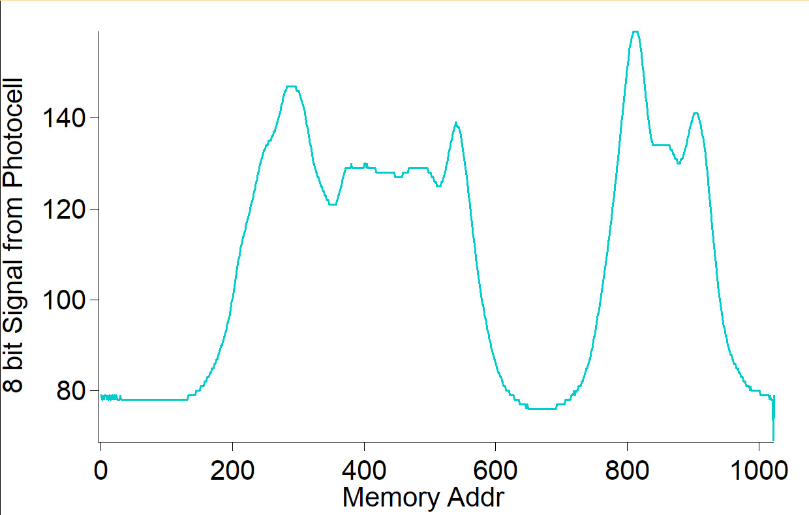

# Data Logger (and using cool sensors!)

*A lab report by William J Leon.*

## In The Report

Include your responses to the bold questions on your own fork of [this lab report template](https://github.com/FAR-Lab/IDD-Fa18-Lab2). Include snippets of code that explain what you did. Deliverables are due next Tuesday. Post your lab reports as README.md pages on your GitHub, and post a link to that on your main class hub page.

For this lab, we will be experimenting with a variety of sensors, sending the data to the Arduino serial monitor, writing data to the EEPROM of the Arduino, and then playing the data back.

## Part A.  Writing to the Serial Monitor
 
**a. Based on the readings from the serial monitor, what is the range of the analog values being read?**

0 - 1023
 
**b. How many bits of resolution does the analog to digital converter (ADC) on the Arduino have?**

10-bit ADC resolution

## Part B. RGB LED

**How might you use this with only the parts in your kit? Show us your solution.**

[Video of RGB LED and Sensors](https://youtu.be/j0pAbgdt1HA)

## Part C. Voltage Varying Sensors 
 
### 1. FSR, Flex Sensor, Photo cell, Softpot

**a. What voltage values do you see from your force sensor?**

It can only produce between 0 and just under 5 V

**b. What kind of relationship does the voltage have as a function of the force applied? (e.g., linear?)**

Non-linear - seems to go as 1/x (some log scale otherwise)

**c. Can you change the LED fading code values so that you get the full range of output voltages from the LED when using your FSR?**

**d. What resistance do you need to have in series to get a reasonable range of voltages from each sensor?**

**e. What kind of relationship does the resistance have as a function of stimulus? (e.g., linear?)**

Non linear

[Video of RGB LED and Sensors](https://youtu.be/j0pAbgdt1HA)

### 2. Accelerometer
 
**a. Include your accelerometer read-out code in your write-up.**

```
#include <SPI.h>
#include <Wire.h>
#include <Adafruit_GFX.h>
#include <Adafruit_SSD1306.h>
#include <Adafruit_LIS3DH.h>
#include <Adafruit_Sensor.h>

#define SCREEN_WIDTH 128 // OLED display width, in pixels
#define SCREEN_HEIGHT 32 // OLED display height, in pixels

// Declaration for an SSD1306 display connected to I2C (SDA, SCL pins)
#define OLED_RESET     4 // Reset pin # (or -1 if sharing Arduino reset pin)
Adafruit_SSD1306 display(SCREEN_WIDTH, SCREEN_HEIGHT, &Wire, OLED_RESET);
Adafruit_LIS3DH lis = Adafruit_LIS3DH();

int avgElement = 0;
float avgVal_x = 0;
float avgVal_y = 0;
float avgVal_z = 0;
long AxisAveraging_x[] = {
  // array to store 20 values that will be averaged
  0,0,0,0,0,0,0,0,0,0, \
  0,0,0,0,0,0,0,0,0,0
};
long AxisAveraging_y[] = {
  // array to store 20 values that will be averaged
  0,0,0,0,0,0,0,0,0,0, \
  0,0,0,0,0,0,0,0,0,0
};
long AxisAveraging_z[] = {
  // array to store 20 values that will be averaged
  0,0,0,0,0,0,0,0,0,0, \
  0,0,0,0,0,0,0,0,0,0
};

void GetAccel() {
  // read acceleration and log the value into the averaging array
  // ... I should reset this block to be window averaging in the
  // ... future

  // ping the accel for data
  sensors_event_t event; 
  lis.getEvent(&event);
  // store data in three variables
  long currVal_x = event.acceleration.x;
  long currVal_y = event.acceleration.y;
  long currVal_z = event.acceleration.z;
  // store the variables dierctly into array
  // ... this code block can be merged with the one
  // ... above in the future
  AxisAveraging_x[avgElement] = currVal_x;
  AxisAveraging_y[avgElement] = currVal_y;
  AxisAveraging_z[avgElement] = currVal_z;
  // increment array index forward by one
  avgElement++;
  // check for array-fill
  if ( avgElement > 19 ) {
    // reset array index
    avgElement = 0 ;
    // zero out the avg value
    avgVal_x = 0;
    avgVal_y = 0;
    avgVal_z = 0;
    // summation of array values loop
    for ( int i = 0 ; i < 20 ; i++ ) {
      avgVal_x = avgVal_x + AxisAveraging_x[i];
      avgVal_y = avgVal_y + AxisAveraging_y[i];
      avgVal_z = avgVal_z + AxisAveraging_z[i];
    }
    // division by number of elements in array
    avgVal_x = avgVal_x/20.0;
    avgVal_y = avgVal_y/20.0;
    avgVal_z = avgVal_z/20.0;
  }
}

void setup() {
  // SSD1306_SWITCHCAPVCC = generate display voltage from 3.3V internally
  display.begin(SSD1306_SWITCHCAPVCC, 0x3C);  // Address 0x3C for 128x32
  lis.begin(0x18);
}

void loop() {
  display.clearDisplay();

  display.setTextSize(1);             // Normal 1:1 pixel scale
  display.setTextColor(WHITE);        // Draw white text
  display.setCursor(0,0);             // Start at top-left corner
  display.println(F("Signal:"));

  float val = 5.0*(analogRead(A0)/1023.0);
  display.setCursor(0,10);
  display.println(val);

  GetAccel();      // get X Y and Z data at once
  display.setCursor(60,0);
  display.print(avgVal_x);

  display.setCursor(60,10);
  display.print(avgVal_y);

  display.setCursor(60,20);
  display.print(avgVal_z);

  display.setCursor(0,20);
  display.print(avgElement);

  
  display.display();
  //delay(20);
}
```

## Optional. Graphic Display

**Take a picture of your screen working insert it here!**

>> photo taken

## Part D. Logging values to the EEPROM and reading them back
 
### 1. Reading and writing values to the Arduino EEPROM

**a. Does it matter what actions are assigned to which state? Why?**

Yes - the state is given by a dial that does not have unlimited 360 turning. If the actions are assigned with clear in the middle, any read and write action would be cleared when switching states.

**b. Why is the code here all in the setup() functions and not in the loop() functions?**

You do not want to continuously write over the data you are reading - only one action needs to be performed per state change

**c. How many byte-sized data samples can you store on the Atmega328?**

1024 byte sized data samples

**d. How would you get analog data from the Arduino analog pins to be byte-sized? How about analog data from the I2C devices?**

For 10-bit ADC reads, you would need to divide by 4 to get the values to be byte sized. For the I2C devices

**e. Alternately, how would we store the data if it were bigger than a byte? (hint: take a look at the [EEPROMPut](https://www.arduino.cc/en/Reference/EEPROMPut) example)**

Using the .put() and .get() functions along with type-setting the values you would want to store (i.e. values that are greater than 8-bit ints)

**Upload your modified code that takes in analog values from your sensors and prints them back out to the Arduino Serial Monitor.**

```
// READ ANALOG SIGNALS - WRITE TO PROM

String textarray = "hello cornell tech!";
int endAddr = 0;
int begAddr = 0;

void state2Setup() {
  digitalWrite(ledPin, LOW);
  
  Serial.println("Writing to EEPROM");
  
  //if any of the pin settings for the different states differed for the different states, you could change those settings here.
  for ( int j = 0 ; j < 1023 ; j++) {
    int photoVal = analogRead(A1)/4;
    endAddr = begAddr + min(1, EEPROMSIZE);
    for (int i = begAddr; i < endAddr; i++) {
      EEPROM.write(i, photoVal);
    }
    begAddr = endAddr;
  }
  Serial.println("Value committed to EEPROM!");
}

void state2Loop() {
  digitalWrite(LED_BUILTIN, HIGH);   // turn the LED on (HIGH is the voltage level)
}

void doState2() {
  if (lastState != 2) state2Setup();
  state2Loop();
}
```

```
// PRINT OUT PROM VALS TO SERIAL PORT

byte value;
extern int begAddr;


void state1Setup() {
  Serial.println("Reading from EEPROM");

  for (int i = 1; i < begAddr + 1; i++) {
  //for (int i = 1; i < EEPROMSIZE+1; i++) {
    value = EEPROM.read(i-1);
      Serial.println(value);
  }
  Serial.println();

  Serial.println("Done reading from EEPROM");
}

void state1Loop() {
  digitalWrite(LED_BUILTIN, LOW);    // turn the LED off by making the voltage LOW
}

void doState1() {
  if (lastState != 1) { state1Setup(); }
  state1Loop();
}
```
### 2. Design your logger
 
**a. Insert here a copy of your final state diagram.**

Data logger uses the switch state code that was provided above. The code (also shown above) fills the entire eeprom with time-ordered 8-bit light data from the photocell resistor and stops once the eeprom is full. The read-eeprom state then transers the data in importable format to the serial monitor to be analyzed by my favorite data analysis software.

### 3. Create your data logger!
 
**a. Record and upload a short demo video of your logger in action.**

Data Output from EEPROM!

